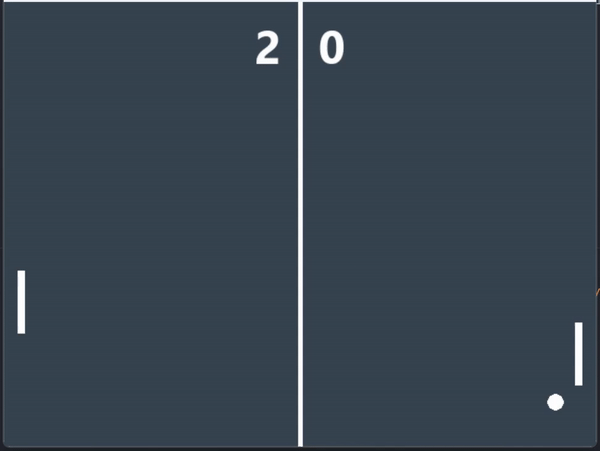

# Pong

Pong is a classic arcade game that simulates a table tennis match. The objective of the game is to prevent the ball from passing your paddle while trying to make the ball pass your opponent's paddle.



## How to Play

- The game starts with the ball positioned at the center of the screen.
- Players must hit the ball with their paddles to prevent it from passing their side of the screen.
- The ball will bounce off the paddles and the top and bottom walls.
- If a player fails to hit the ball, the opposing player scores a point.
- The game continues until a certain score limit (11) is reached or until players decide to end the game.
- Player 1 (Left Paddle): Use the **W** and **S** keys to move the paddle up and down, respectively.
- Player 2 (Right Paddle): Use the **Up Arrow** and **Down Arrow** keys to move the paddle.

## Dependencies

The game requires Python and the Pygame library to be installed on your computer. You can install Pygame using pip:

``` bash
pip install pygame
```
